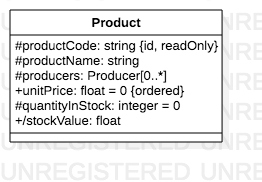
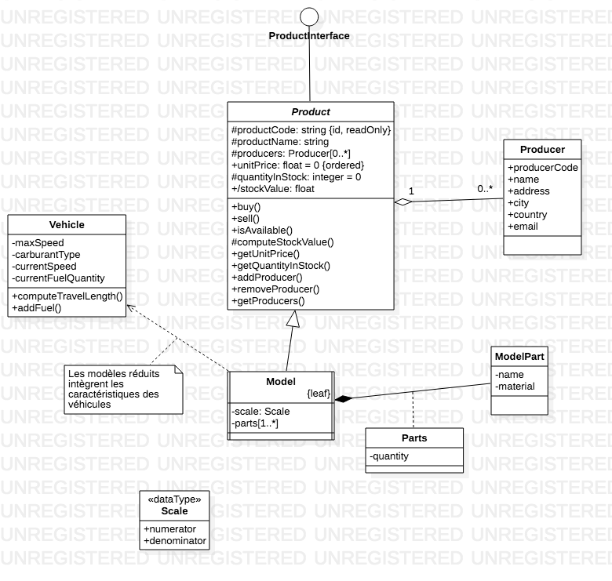

# Diagrammes de classes

## Résumé

## Introduction

Les diagrammes de classes sont sans doute les plus emblématiques des diagrammes structurels de UML.
Ils sont l'équivalent des classes en dans la ProgrammationOrientée Objet.
Il ne faut pas oublier que le développement des prémisses de UML a commencé concommitemment à l'arrivée de C++ comme langage de référence dans l'industrie.

Les diagrammes de classes décrivent, de manière beaucoup plus détaillée un modèle Entité/Association.

## Description d'une classe

En première approximation, une classe comporte, exactement comme une classe PHP :
* un nom
* des propriétés (nommés attributs)
* des méthodes (nommées opérations)

### Propriétés

D'après la spécification (§ 9.5, pp. 151 seq.), une propriété est une **StructuralFeature** et en particulier un attribut d'un **Classifier**.
C'est une définition qui va au-delà des classes, mais pour ce qui nous intéresse, cela permet de définir :
* le nom
* la visibilité (public, protégée ou privée)
* le type
* la multiplicité
* si c'est une propriété de classe ou d'instance
* si la propriété est modifiable ou non
* une valeur par défaut
* si c'est un identifiant (e.e. une clef primaire)
* si la valeur est unique
* les valeurs sont ordonnées
* si elle est dérivée
* si c'est une redéfinition d'une propriété héritée
* si la valeur est dérivée (calculée)

### Opérations

Le versant « comportemental » des classes est défini par l'ensemble des **Operation** qui, si l'on regarde la documentation sont des **BehavioralFeature**.
Un **Operation** peut être associé à d'autres objets que des classes, typiquement des interfaces ou des “types de données”.
De mnaière très classique, une opération est défnie par (§ 9.6, pp. 156 seq.) :

| Attribut | Sémantique | Remarques |
|---|---|---|
| Nom | Le nom de la méthode | |
| Visibilité | Le statut de la méthode  : public, protégée, privée | notation : + # - |
| Signature | La liste des paramètres (typés) de la méthode | |
| Type de retour | | |
| Multiplicité | la multiplicité des valeurs retournées | |
| Propriétés | Un ensemble de propriétés applicables à la méthode | les résultats sont-il ordonnées, est-ce une redéfinition (polymorphisme), y a-t-il des contraintes sur la méthode, etc. |

### Associations

Il existe de nombreuses options pour définir les associations.

| Attribut | Sémantique | Remarques |
|---|---|---|
| Direction | Définit une asymétrie dans l'association (une source et une cible) | Optionnel, si absente une association simple est définie |
| Navigable | Définit si la cible est accessible depuis la source | Optionnel |
| Agrégation | Définit que certains objets sont mutualisés dans la définition d'autres objets | Représentée par un losange creux |
| Composition | Définit que des des objets sont des parties (inhérentes) d'autres objets | Représentée par un losange plein |
| Dépendance | Définit qu'un objet entre dans la spéficication d'un autre objet | cf. la notion de Trait en PHP |
| Généralisation | Définit qu'une classe hérite d'une autre classe | |
| Réalisation | Définit qu'une classe réalise une interface | |

Dans la spécifiction d'UML, rien ne restreint les associations à être binaires (c'est-à-dire avec deux extrêmités).
Il est tout à fait possible d'imginer des relations ternaires, voire n-aires.
Cependant peu d'éditeurs intègrent cette possibilité et, bien qu'elle soit sémantiquement riche, les implémentations dans les langages de programmation obligent de toutes façons à revenir à des associations binaires.
 

## Interface

Les interfaces sont représentées par des cercles.
Comme pour les classes, il est possible de décrire les propriétés et les méthodes (et les réceptions) qui définissent le « contrat » de l'interface.
En PHP, les interfaces ne peuvent contenir que des méthodes, donc la représentation UML ne pourra pas touours être intégralement implémentée, en fonction des langages.

