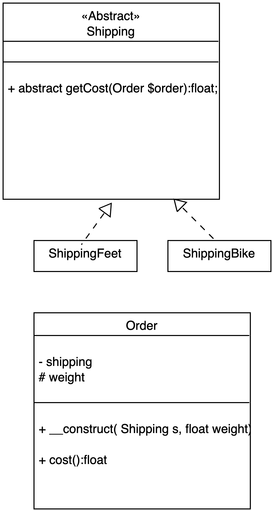
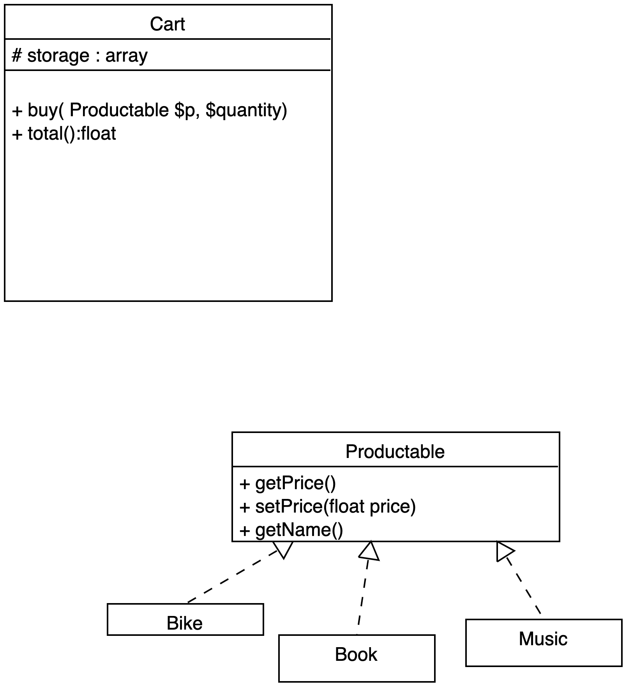
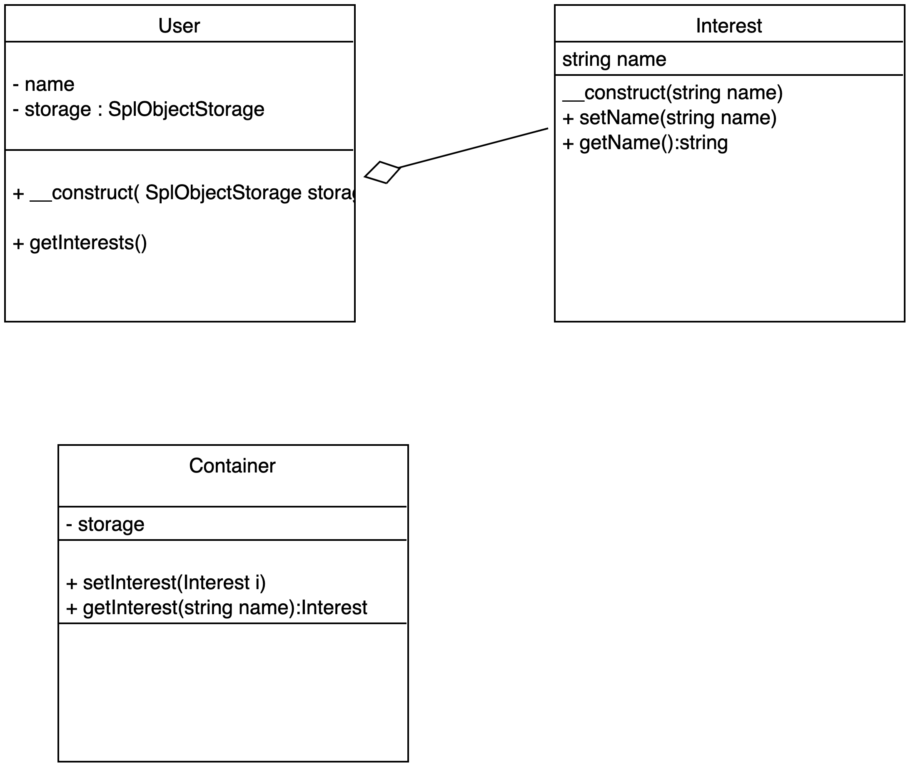
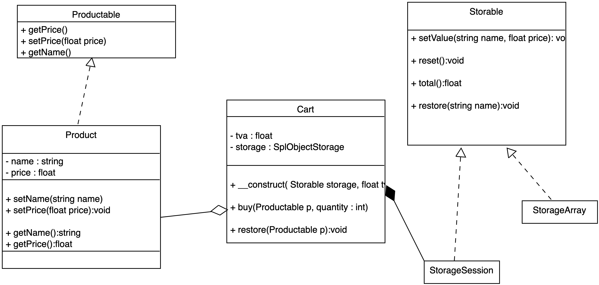

# SOLID

## Présentation du principe SOLID. 

Les principes S.O.L.I.D. permettent de rendre les applications plus modulables, extensibles et testables. Ils régissent la programmation orientée Objet et permettent de construire des Design Patterns (Observer, Decorator, ...) et Framework (comme Symfony par exemple).

## S.O.L.I.D.

Nous présentons les concepts de S.O.L.I.D. ci-dessous, nous les détaillerons par la suite pour bien les maîtriser en faisant des exercices.

- Single Responsability
*Attribuer des responsabilités limités et uniques et bornés à une classe.*

- Open/Close
*Une classe doit être fermée aux modifications, on ne casse pas le code existant, mais ouverte aux
extensions.*

- Liskov substitution
 *Si un objet A se réfère à un objet B, on doit pouvoir substituer B par une de ses classes filles (C par exemple), sans que A n'en soit impacté.*

- Interface segregation
*Un objet A ne doit par "consommer" directement un objet B, il doit consommer son interface.*

- Dependency injection
*Les objets ne doivent pas créer eux-mêmes les objets dont ils dépendent, on doit les injecter (on crée les instances à l'extérieur de la classe, puis on les "injectent". On ne fait pas de new dans une classe).*


## Exercice Single Responsability Lamp

Soit une lampe qui peut s'alumer et s'éteindre... Déterminez deux responsabilités distinctes : Light (on/off) et Lamp et mettez les en relation.  

Dans cet exercice vous implémenterez une méthode **__toString** dans la classe Lamp pour connaître son état (on ou off). Voyez l'extrait de code ci-dessous :

```php
// code ...
// $lamp est une instance de la classe Lamp
echo $lamp; // Off
$lamp->switch();
echo $lamp; // On
```

## Exercice Open/Closed Shipping

Principe Open/Closed. Ajoutez une nouvelle fonctionnalité ne doit pas casser les fonctionnalités existantes ... Vous pouvez par exemple, pour respecter ce principe, étendre une classe A par une classe B. La classe B étendue récupère les fonctionnalités de la classe A et peut ainsi ajouter d'autre(s) fonctionnalité(s) sans modifier le code de la classe B.

Soient les classes Shipping, Order, BykeShipping et FeetShipping. Comment mettre en place cette notion de Open/Closed dans ce contexte ? 

Implémentez et définissez les bonnes relations entres ces classes pour répondre à la question. Aidez vous du diagramme de classes et de l'exemple de code suivant pour l'implémenter.



Implémentez la méthode **cost**, elle donnera le coût d'une livraison en fonction du type de livraison (vélo ou à pied) et du poids (attribut de la classe Order).

Une classe fille peut modifier et re-définir/définir des actions sans casser le code de la classe mère.

Aidez-vous du code suivant :

```php

spl_autoload_register(function ($class) {
    include __DIR__ .'/'.$class.'.php';
});

// Livraison Bike
$order = new Order( new ShippingBike, 100 );

echo $order->cost();
echo "\n";

// Livraison Feet
$order = new Order( new ShippingFeet, 100 );

echo $order->cost();
echo "\n";
```

## Questions d'analyse

Nous allons analyser le code ci-dessous et déterminer ce qui pose problème au niveau de sa conception.

Voici deux classes Product et Book, cette dernière hérite de la classe Product. La classe Book surcharge la méthode **priceTTC**.

```php
class Product
{
    public $price;
    public $name ;

    public function __construct(float $price, string $name)
    {
        $this->name = $name;
        $this->price = $price;
    }

    public function priceTTC(float $price, float $tva)
    {
        return $price * (1 + $tva);
    }
}

class Book extends Product
{
    public function priceTTC(float $price, float $tva, float $taxe)
    {
         $this->price = $price * (1 + $tva) * $taxe;
    }
}
```

La classe Cart permet d'acheter des produits.

```php
class Cart
{
    private $total = 0;
    private $products = [] ;

    public function setProduct( Product $product){
        $this->products[] = $product;
    }

    public function total()
    {
        // calcul du prix total
        foreach($this->products as $product)
            $this->total += $product->priceTTC($product->getPrice(), .2);
    }
}
```

Répondez aux questions suivantes :

1. La classe Book est-elle conforme au principe SOLID ?

2. Que se passe-t-il si on ajoute des Book à la classe Cart et que l'on calcule le total des prix TTC ?

3. Quel principe doit-on appliquer pour coder correctement la classe Book, si on doit surcharger (re-définir) la méthode priceTTC ?

## Exercice Interface ségrégation

Soit une classe Cart. On aimerait pouvoir ajouter dans cette classe des produits différents : Book, Music, Byke,... Sans avoir d'erreur. Implémentez une interface Productable et utilisez la comme type dans l'injection des produits dans la méthode buy.

Aidez-vous du diagramme de classe et du code ci-dessous :



```php

spl_autoload_register(function ($class) {
    include __DIR__ .'/'.$class.'.php';
});

$products = [
    new Book('Moby Dick', 30),
    new Music('AC/DC', 17.5),
    new Bike('Brompton', 1430),
];

$cart = new Cart;

foreach($products as $product)
    $cart->buy($product, 5);

echo  $cart->total()  . "\n";
```

## Exercice Dependency injection

Rappelons que l'on ne doit pas faire de new à l'intérieur d'une classe. Vous devez, à la place, injecter les dépendances en utilisant par exemple de l'agrégation (setter et getter pour l'objet).

Nous verrons également que l'on utilise ce que l'on appelle des containers de services qui préparent les instances de classe que l'on injecte par la suite dans nos classes.

Pour gérez le "storage" des intérets des utilisateurs, vous pouvez utiliser SplObjectStorage de PHP ou un tableau PHP.

1. Soient la classe User et la classe Interest. Implémentez ces deux classes en vous aidant du code ci-dessous :

```php
spl_autoload_register(function ($class) {
    include __DIR__ .'/'.$class.'.php';
});

$storage = new SplObjectStorage;
$alan = new User( $storage );

$python = new Interest('Python');
$alan->setInterest($python);

$php = new Interest('PHP');
$alan->setInterest($php);

$javascript = new Interest('Python');
$alan->setInterest($javascript);

echo "\n";
$alan->getInterests();
echo "\n";
```

2. Créez la classe Container. Elle configurera les intérêts des utilisateurs. Aidez-vous du diagramme de classe ci-dessous pour implémenter le code.

```php
// Préparer les intérets dans un container de service

$container = new Container( new SplObjectStorage );

$sql = new Interest('SQL');
$container->setStorage($sql, 'SQL');

$alan->setInterest($container->getStorage('SQL'));

$bigdata = new Interest('DATA');
$container->setStorage($bigdata, 'DATA');

$alan->setInterest($container->getStorage('DATA'));

var_dump($container->getStorage('DATA')); // retourne un intéret dans le container

echo "\n";
$alan->getInterests();
echo "\n";
```

Diagramme de classes :



## Exercice Cart synthese

Vous allez maintenant faire un exercice de synthèse sur les concepts SOLID que nous avons abordé.
 
Vous devez appliquer les principes S.O.L.I.D.

Utilisez composer pour l'autoloader. Toutes les classes du projet seront placées dans un dossier src/. 

```text
src/
    Cart.php
    Storable.php
    Productable.php
    Product.php
    StorageArray.php
    StorageSession.php 
app.php
composer.json
```

Dans le fichier **composer.json** vous devez configurer votre autoload comme suit :

```json
"autoload": {
    "psr-4": {
        "": "src/"
    }
}
```

Identifiez bien chaque entité dans le projet en utilsant le diagramme de classe ci-après.

Deux systèmes de persistance seront testés : un StorageArray ou StorageSession.

Le panier est un panier d’un magazin bio vendant des fruits, créez
quelques produits pour tester vos méthodes.

Aidez-vous également du code ci-dessous pour créer ce panier.

- Diagramme de classe



- Exemple d'utilisation du code

```php

require_once __DIR__ . '/vendor/autoload.php';

// création des produits
$products = [
    'apple' => new Product('apple', 10.5),
    'raspberry' => new Product('raspberry', 13),
    'strawberry' => new Product('strawberry', 7.5),
    'orange' => new Product('orange', 7.5),
];

$storageSession =  new StorageArray;
$cart = new Cart($storageSession);

extract($products);

$cart->buy($apple, 3);
$cart->buy($apple, 4);
$cart->buy($apple, 5);
$cart->buy($strawberry, 10);

echo "\n";
echo $cart->total() ; // 241.2
echo "\n";

// retire un produit du panier
echo "restore" . "\n";
$cart->restore($strawberry);

echo "\n";
echo $cart->total() ; // 151.2
echo "\n";
```