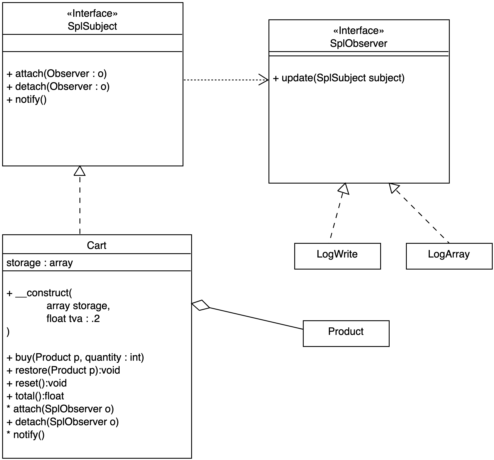

# Design Patterns

## Définition

C'est un "assemblage" de modules ou classes, qui utilisent le paradigme S.O.L.I.D., et qui apporte une solution à un problème récurrent dans le code.

Les design Patterns permettent de construire des applications modulables, évolutives et testables.

## Observer

### Intérêt 

Ce pattern est très utile pour déclencher une/des action(s) en fonction d'une autre. Par exemple, si un utilisateur commande un produit on notifie cette commande dans une table spécifique pour faire des statistiques sur les achats. On peut également notifier d'autre information en fonction de l'achat, et cela sans modifier le code de la classe observée.

L'Observer est donc une solution modulable, évolutif et testable pour ce type de problème par exemple.

### Exemple

- L'interface **SplSubject** de PHP, cette interface définie une classe donnée comme observable (Subject), elle devra donc implémenter (interface) des méthodes spécifiques (attach, detach et notify) : 

```php

class User implements SplSubject{

    private $id;
   
    public function attach(SplObserver $observer) {
        $this->observers[] = $observer;
    }

    public function detach(SplObserver $observer){}

    public function notify() {

        foreach ($this->observers as $value) {
            $value->update($this);
        }
    }

    public function create(string $name, string $email):void {

        $this->id = uniqid(true);
        $this->notify();
    }

    public function getId(){
        return $this->id;
    }
}
```

Voyons maintenant une classe observeur (Observer) avec l'interface SplObserver (méthode update) de PHP :

```php

class Log implements SplObserver{

    public function update( SplSubject $subject) {
        echo "log :" . $subject->getId() . "<br>";
    }
}
```

Maintenant, si vous créez un utilisateur la méthode create de User le notifie à son/ses observeur(s) :

```php
$subject = new User;
$subject->attach(new Log);

// crée un nouvel utilisateur => notification 
$subject->create('Alan', 'alan@alan.fr');
```

### Exercice Cart Observer

Soient les classes Cart, Product et les observeurs LogFile et LogArray. La classe Cart sera la classe Subject (Observable).

Remarque : pour la classe Cart utilisez un tableau PHP comme storage, nous voulons ici faire une version plus simple de cette classe.

A chaque fois que vous ajoutez un produit dans le panier, notifiez le total des prix à ses observeurs.

L'observeur LogFile enregistrera le nom du produit commandé dans un fichier log.txt ( à la racine du projet ). L'observeur LogArray notifiera l'ajout du produit dans un array.

- Utilisez la fonction **file_put_contents** de PHP pour écrire une ligne dans un fichier. Le flag **FILE_APPEND** de cette fonction indique de rajouter ce contenu à la suite dans le fichier.

```php
file_put_contents('log.txt', $product->getName(), FILE_APPEND);
```

La classe Cart implémentera nécessairement (contrat de l'interface SplSubject ) les méthodes suivantes :

- attach( SplObserver $o) pour ajouter un observeur de la classe Cart.
- detach(SplObserver $o) pour supprimer un observeur de la classe Cart.
- notify() notifie à l'observeur d'une action

Aidez-vous du diagramme de classe et du code ci-dessous, vous ajouterez des produits et vérifierez que les notifications ont été effectué. Créez une méthode getStorage, par exemple, dans l'observeur LogArray pour contrôler les notifications. 



```php

spl_autoload_register(function ($class) {
    include __DIR__ .'/'.$class.'.php';
});

$cart = new Cart([]);

$logFile = new LogFile;
$LogArray = new LogArray;

// Ajoutez des produits ...

var_dump($LogArray->getStorage()) ;

// détachez un observeur :
$cart->detach($logArray);

// recommandez des produits et vérifiez qu'ils ne sont pas de LogArray

var_dump($LogArray->getStorage()) ;

```

