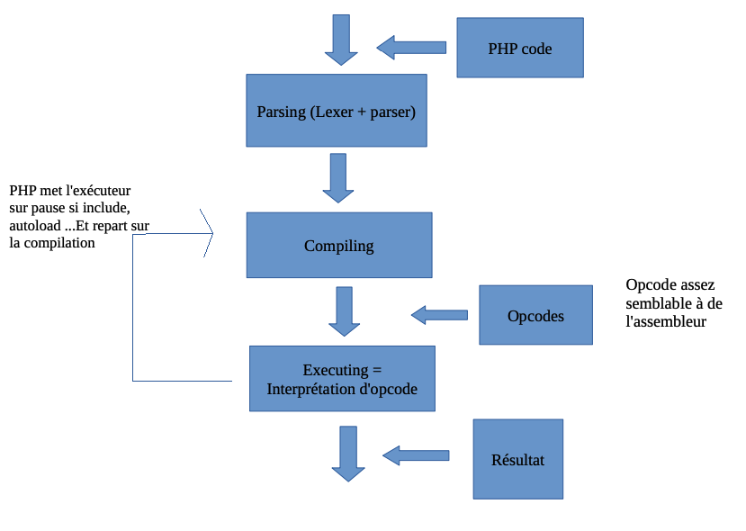
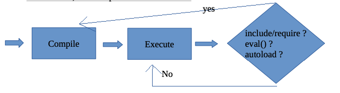
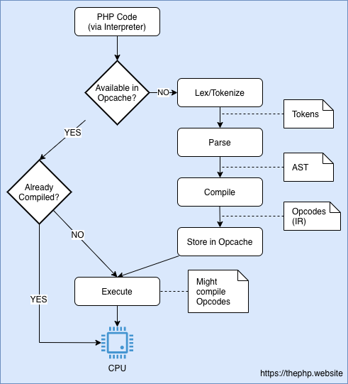
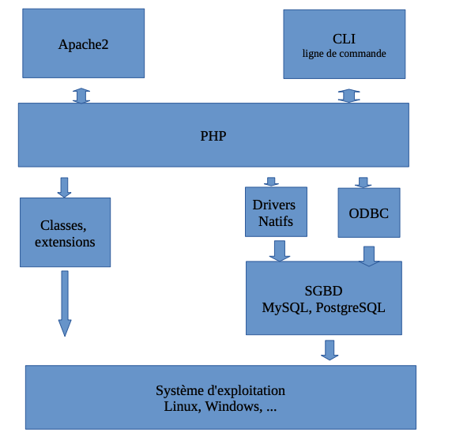

# Présentation PHP

## Fonctionnement



La première chose que PHP fait c'est de parser le code (analyse de la syntaxe), il essaye de comprendre ce que l'on a écrit, il vérifie qu'il n'y a pas de parser error, si c'est le cas il arrête tout et retourne un message d'erreur.

PHP compile le code si aucune erreur n'est levée, dans un code intermédiaire que l'on appelle l'opcodes.


L'opcode sera alors exécuté par la machine virtuelle de PHP pour produire un résultat.

Def du machine virtuelle, c'est un logiciel qui exécute des instructions produisant des résultats identiques quelque soit la plat forme matériel sous-jacente. L'opcode exécuté par cette machine virtuel produira sous Windows ou Linux, par exemple, des résultats identiques.

Remarque importante. PHP compile le code puis exécute l'opcodes et vide entièrement sa mémoire une fois qu'il a terminé.
Compile, execute, forget, Compile, execute, forget, Compile, execute, forget, ...
Comment marche la compilation, une exécution peut déclencher une compilation, si on a dans le script des includes, require, autolaod, ... Un code qui s'exécute peut donc s'arrêter pour compiler du code include, ...Puis reprendre son exécution.




## Evolution avec JIT à partir de PHP 8




## Quelques remarques sur l'installation de PHP

 L'intégration de PHP dans le serveur Apache peut se faire de deux manières différentes :

- Entant que module Apache,  PHP est directement intégré dans le serveur Web =>le code PHP sera directement exécuté par le même processus que celui du serveur Web.

- Via l'interface CGI (common Gateway Interface), c'est un standard qui indique comment transmettre la requête du serveur HTTP au programme et comment récupérer la réponse. CGI est indépendant du langage de programme, on peut avoir Python, PHP, ...Mais cette technique nécessite pour chaque requête un lancement d'un nouveau processus.

Cependant, il existe une évolution de CGI : FastCGI, elle permet de ne lancer le programme CGI qu'une seule fois, et pas à chaque requête. Cette technique nécessite pour chaque langage concerné une bibliothèque supplémentaire installée, pour PHP c'est PHP-FPM. Dans un premier temps sur les machines on a PHP en module Apache, pour Wamp et MAMP.




## Connaître la configuration de PHP

dans un fichier sur le serveur Web créez un fichier info.php dans le dossier htdocs puis visitez la page Web :

```bash
echo "<?php phpinfo(); " > info.php
```

## Fichier php.ini

PHP cherche un fichier nommé php.ini, si PHP est installé en tant que module apache ce fichier se trouve dans le dossier php/apache2/, en général sous Linux par exemple on le trouve dans /etc/php/apache2/php.ini. On retiendra que PHP cherche le fichier php.ini en fonction de la SAPI ,Server Application Programming Interface, (CGI, FastCGI, CLI, ...). Il faut donc savoir où se trouve ce fichier.

Pour MAMP il se trouve a priori dans Applications/MAMP/config/php/php.ini.

On va ouvrir le fichier php.ini concernant le PHP installé en tant que module Apache2, à l'aide d'un éditeur de code comme vscode par exemple. Et on vérifie les points suivants :

- max_execution_time=30, pour limiter le temps d'exécution d'un script, c'est une protection contre les boucles inifinies.

- max_input_time=60, pour limiter la durée maximale pour recevoir les données d'entrée, via POST, GET, et FILES.

- memory_limit=64M, limite la mémoire vive allouée par PHP et par ses extensions (gestion des images par exemple)
