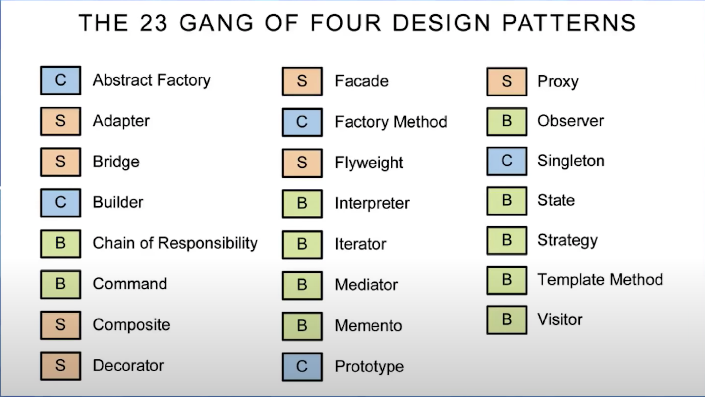

# Présentation des design patterns (patron de conception)

On peut se donner une image pour bien comprendre la notion de design patterns dans une application. Il contrôle la propagation de l'information dans une application.

En développement logiciel un design pattern est un assemblage de modules ou classes, reconnu comme une bonne pratique en réponse à une problématique métier donnée.

Les design patterns présentent les procédés de conception généraux. Ils ont évidemment une influence sur le développement des applications.

Attention, ne confondez pas les patrons de conception et les patrons d'architecture. Un patron d'architecture est plus généraliste. Par exemple le **Lazy loading** (chargement fénéant) est un patron d'architecture. Le Lazy loading régle le problème de chargement des données en ne chargeant qu'une partie des données nécessaires dans l'application.

## Patrons de conception GoF

Les patrons de conception ont été présentés en 1994 dans un livre "Elements of Reusable Software" co-écrit par quatre auturs : Gamma, Helm, Johnson et Vlissides : GoF. Se livre décrit et explicite leurs utilisations de 23 patrons de conception

Il existe trois familles de patrons de conception selon leur utilisation :

- créateurs : ils définissent comment faire l'instanciation et la configuration des classes et des objets.

- structuraux : ils définissent comment organiser les classes d'un programme dans une structure plus large (séparant l'interface de l'implémentation).

- comportementaux : ils définissent comment organiser les objets pour que ceux-ci collaborent (distribution des responsabilités) et expliquent le fonctionnement des algorithmes impliqués.

Nous allons étudier un certain nombres de ces patrons de conceptions.

## Ensemble des patrons de conception théorique

Nous présentons les 23 patrons de conception ci-dessous les plus théorisés (Gof)

- Structural

- Creational

- Behavioral

